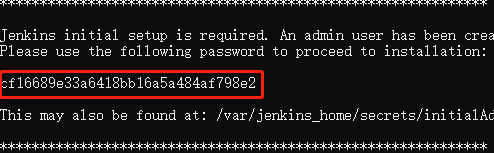
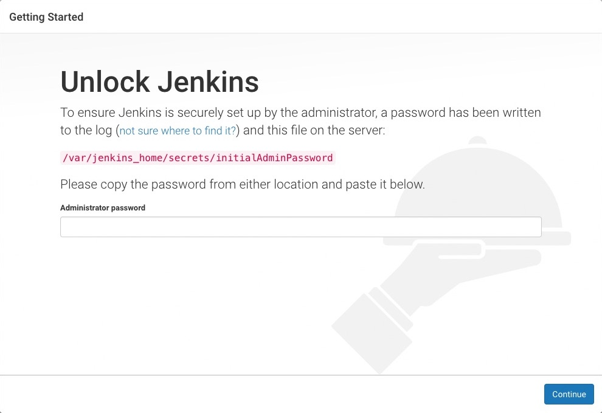

## 本文目的
利用docker快速搭建用于测试目的的Jenkis环境。

## 环境说明
- Windows 10 v1803
- Docker Version 18.03.1-ce-win65 

## 准备
- 启用docker
- 拉取镜像jenkinsci/blueocean
- 在CMD中执行下面命令启用jenkins
``` cmd
docker run ^
-u root ^
--rm ^
-d ^
-p 8080:8080 ^
-p 50000:50000 ^
-v jenkins-data:/var/jenkins_home ^
-v /var/run/docker.sock:/var/run/docker.sock ^
--name jenkins-blueocean ^
jenkinsci/blueocean
```
- 第一次启用时需从启动日志中获取启动密码，在docker中可以通过dockerM命令行日志获取，启动jenkins的docker日志
```
docker logs jenkins-blueocean
```
相应密码在：



- 启动浏览器，访问http://localhost:8080，首次访问jenkins会遇到如下界面，需要解锁访问，密码为上步中获取的密码；

- Jenkins环境已准备，即可开始使用