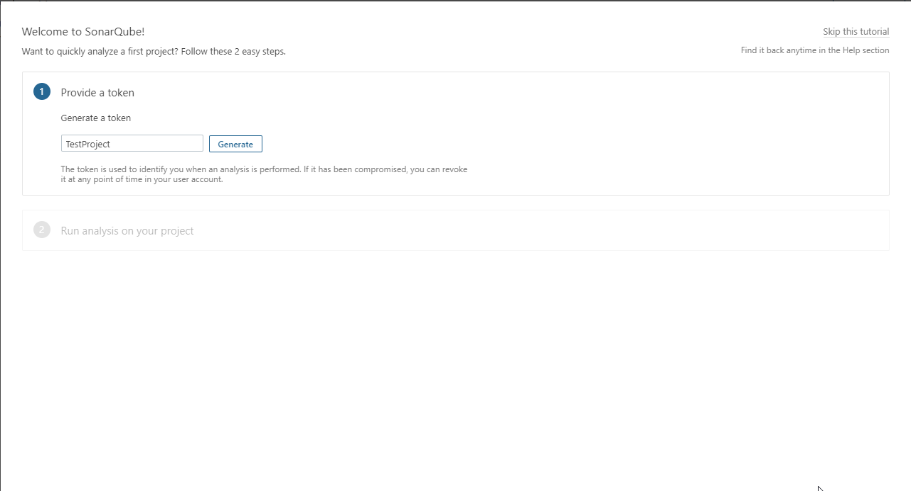
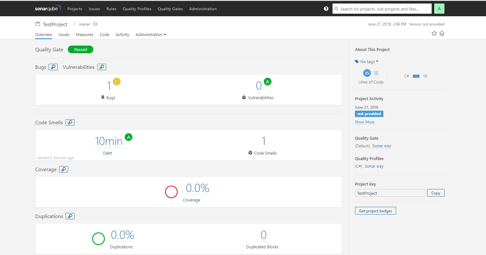

## 环境说明
- Windows 10 v1803
- Docker Version 18.03.1-ce-win65 
- [JDK1.8](http://www.oracle.com/technetwork/java/javase/downloads/jdk8-downloads-2133151.html)
- .NET Core 2.x

## 准备条件
- 使用docker-compose准备Sonarqube环境
- 本地安装dotnet-sonarscaner工具
```cmd
dotnet tool install --global dotnet-sonarscanner --version 4.3.1
```

## 启动Sonarqube:
- 打开命令行，切换到此目录
- 运行命令: 
```cmd
docker-compose up
```
- 打开浏览器，访问http://localhost:9000
- 完成
- 重启
```cmd
docker-compose restart sonarqube
```

## 扫描代码
- 打开浏览器，访问http://localhost:9000，使用管理员账号密码登录(默认都是admin),进入Sonar项目管理界面
 
 - 输入项目名称，生成token
 - 点击继续，选择项目类型，输入项目唯一key（任意字符，唯一即可）
 - 点击完后会生执行步骤，可复制，稍后使用
 - 打开命令行(cmd或powershell)窗口，切换目录到项目目录下
 - 依次执行刚才复制的命令
 ```cmd
dotnet sonarscanner begin /k:"TestProject" /d:sonar.host.url="http://localhost:9000" /d:sonar.login="cfe594fd605f2e4821835e43c69da82e489c2f23"
dotnet build
dotnet sonarscanner end /d:sonar.login="cfe594fd605f2e4821835e43c69da82e489c2f23"
```
- 等待命令执行完毕后即可重新访问http://localhost:9000查看扫描报告
 

## 注意事项
- 本地需安装配置JDK，否则执行dotnet sonarscanner end会失败
- 如果是对整个解决方案进行扫描，或目录下有多个项目时，需在dotnet build命令后添加要扫描的解决方案或项目，如
``` cmd
dotnet build ./test.sln
```

## 参考
- 原始文件[docker-compose](https://github.com/SonarSource/docker-sonarqube/blob/master/recipes.md)
- [使用说明](https://www.cnblogs.com/myzony/p/9233667.html)
- [dotnet build](https://docs.microsoft.com/zh-cn/dotnet/core/tools/dotnet-build?tabs=netcore2x)
- [dotnte tool install](https://docs.microsoft.com/zh-cn/dotnet/core/tools/dotnet-tool-install)